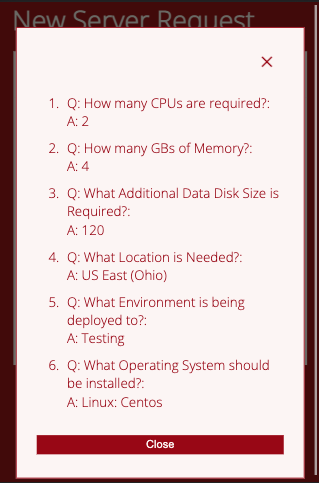
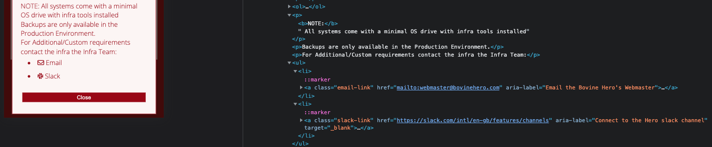

# New Server Requisition Order (Quiz)
(Developer: Gary Grant)

### TODO List
1. import the wireframes
2. Finalise media query styles, Bug hunt and discuss 
3. amiresponsive
3. Final Code review and comments

> TODO: get from amiresponsive

[Live Site](https://bovinehero.com/vm-order-generator/index.html) is hosted on github pages with a custom DNS CNAME provided by Google DNS.

## Table of Contents

1. [Project Goals](#project-goals)
    1. [User Goals](#user-goals)
    2. [Client Goals](#client-goals)
2. [User Experience](#user-experience)
    1. [Key Information on the Site](#key-information-on-the-site)
    2. [Target Audience](#target-audience)
    3. [User Requirements and Expectations](#user-requirements-and-expectations)
    4. [User Stories](#user-stories)
3. [Design](#design)
    1. [Design Considerations](#design-considerations)
    2. [Colour](#colour)
    3. [Fonts](#fonts)
    5. [Imagery](#imagery)
    4. [Structure](#structure)
    5. [Wireframes](#wireframes)
4. [Technologies Used](#technologies-used)
    1. [Languages](#languages)
    2. [Frameworks and Tools](#frameworks-and-tools)
5. [Features](#features)
    1. [Future Implementations](#future-implementations)
    2. [Accessibility Features](#accessibility-features)
6. [Testing](#testing)
    1. [HTML Validation](#HTML-validation)
    2. [CSS Validation](#CSS-validation)
    3. [JavaScript Validation](#JavaScript-validation)
    3. [Accessibility](#accessibility)
    4. [Performance](#performance)
    5. [Device Testing](#device-testing)
    6. [Browser Compatibility](#browser-compatibility)
    7. [Testing User Stories](#testing-user-stories)
8. [Bugs](#bugs)
9. [Deployment & Local Development](#deployment)
10. [Credits](#credits)
11. [Acknowledgments](#acknowledgments)

## Project Goals 

One of the big issues I face as an infrastructure engineer is the way in which people request new virtual machines, I never get all the details I need on the initial request and there tends to be some back and forth which wastes everyone's time.

Thus this project endevours to simulate the process of requesting a new Virtual Machine (VM) from the Infrastructure team. 

### User Goals
+ Should be able to order a new VM based on the offerings available

### Client Goals
+ Users should recieve all the information needed to provision a new VM

## User Experience

### Key Information on the Site
+ On the landing site some basic instructions on how to use the form is present.
+ All the available configurations on the site load are available in the form. 

### Target Audience
+ Junior and Senior technical staff looking to order new virtual hardware for projects

### User Requirements and Expectations

+ A simple and intuitive navigation system
+ Quickly and easily find information
+ Links and functions that work as expected
+ Good presentation and a functional design that enables an order completion
+ Accessibility 

### User Stories

#### Employee
1. I would like to raise an order for a new VM.
2. I would like to select different hardware specifications (OS, CPU, Disk sizes etc) for my VM.
3. I would like to specify the physical and logical environments for the VM's deployment.
4. I would like to review my answers before submission.
5. I should be able to see information on how to use that app.
6. I would like to be able to navigate between questions.

### Client (Site Owner) Stories
7. As a site owner, I want users to be able to contact us for custom requests or issues.
8. As a site owner, I want users without Javascript enabled to be able complete an order

## Design

### Design Considerations

Due to the JavaScript requirement this site really needed to be a single page app, and by virtue the requirement boiled down to a web form best practice dictates a simplistic approach.

With this in mind I initally considered a simple landing page with text instructions and a button to launch a web form. While this design would have easily met the brief it did not provide ample oppertunity to explore a significantjavascript implementation. In order to provide a more inteactive experience I settled on implementing a javascript generated "slideshow" format for the questions.

### Colour

The company I currently work for utilises a lot of red, black and white in their primary colour scheme, and I wanted quite a striking screen on the load.

I selected the pinkish red __Carmine__ (#990011) as a brilliant background color and then the complimentary shade of __Snow__ (#FCF6F5) for the primary colours to give homage to the themes on my employer's intranet site. As a contrast to __Snow__ i decided to use its opposite __Rich Black__ (#03090A) for areas that needed text on a white or snow background.

> As Protanopia cannot distinguish Red from black, care was taken to ensure the the carmine was not placed on black anc vice versa

The colour [palette](https://coolors.co/990011-fcf6f5-03090a) was created using the Coolors [website](https://coolors.co/).

### Fonts

Google Fonts was used for the following fonts:

+ __Open Sans__ for the entire body text on the site. It is a sans-serif font and was selected for its readibility as it designed for legibility across print, web, and mobile interfaces; paramount for the completion of a form.

### Imagery

As the app is an order form, no images were used in this site to keep the workflow simple however font awesome icongraphy was implemented for the help, slack and email functionality.

### Structure

The website consists of a single page, presented to the user as a slide deck of questions.

The question's page is structured in a well known, recognizable, user friendly, and easy to learn way. Upon arriving to the website the user is presented with the first question with familiar navigation buttons. As the intended user is assumed to be familiar with the concepts of Virtual Machines and the deployment environments in the company no effort is made to explain this in the quiz workflow.

The functionality of the order quiz has been replicated wihout the use of JavaScript (purely HTML and CSS) in a `<noscript>` tag.

Additionally there is a 404 page included that will return the website user to the home page.

### Wireframes

Wireframes were created on desktop for a mobile first approach was initially considered, the wireframes below show the initial concept for the site. 

> TODO: make the wireframes

 

Index Page Wireframe Mobile 

 

 

The landing page is the same design for all screen sizes, but is allowed to expand down if the information volume in the text box requires it. On larger screen sizes the fonts and buttons change size to use more of the screen real estate via media queries.

## Technologies Used

### Languages

HTML, CSS and JavaScript were used to create this website.

### Frameworks and Tools

[Balsamiq](https://balsamiq.com/wireframes/) - Used to for wireframes.

[Github](https://github.com/) - To save and store the files for the website and for version control.

[Github Pages](https://pages.github.com/) (Jekyll) - to host the site 

[W3C validator](https://validator.w3.org/) - to test for syntax errors in HTML code

[Jigsaw CSS validator](https://jigsaw.w3.org/css-validator/) - check for syntactic errors in the css code 

[JSHint JavaScript validator](https://jshint.com/) - check for syntactic errors in the JavaScript code 

[WAVE Web Accessibility Evaluation Tool](https://wave.webaim.org/) - check accessibility

[Google Fonts](https://fonts.google.com/about) - fonts used on the website were imported from here

[Font Awesome](https://fontawesome.com/search) - for iconography on the website

[Google Dev Tools](https://developer.chrome.com/docs/devtools/) - troubleshooting and testing features as well as implement responsive styling

[GitPod](https://www.gitpod.io/) - for active development 

[Code Institute Development Template](https://github.com/Code-Institute-Org/gitpod-full-template) - for setting up the initial development environment

[ezgif](https://ezgif.com/) image/media conversion to webp and gif for documentation

[Coolors.co](https://coolors.co/) for colour pallette image

[Favicon.io](https://favicon.io/) - create favicon.

[Am I Responsive?](https://ui.dev/amiresponsive) - prototyping website image on a range of devices.

[Google DNS](https://developers.google.com/speed/public-dns) - hosting name resolution

## Features

The website is comprised of a single page app, a mock response of a downstream api (the CI formdump) and a custom 404 page which which will return the user to the home page should they click on an expired link or otherwise get lost on the site.

+ index.html
  + A noscript fallback to html only order form was implemented for accessibility and compatibility in order to ensure users without javascript enabled browsers can still complete an order.
    + User Stories Covered: 8
      + Order form loaded with no JavaScript    
  
  + A slideshow style set of radio questions to allow users to specify VM criteria based on available Hardware, Operating System, Environment and Location options. This feature includes navigation buttons to traverse through questions and then a submit button appears on the last question page. All of the content is genererated within JavaScript. - the review quesions functionality is covered below in the Review Modal Feature.
    + User Stories Covered: 1, 2, 3 & 6
      + Slideshow Page 1 CPU  
      + Slideshow Page 2 Memory  
      + Slideshow Page 3 Data Disk  
      + Slideshow Page 4 Location  
      + Slideshow Page 5 Environment  
      + Slideshow Page 6 Operating System  
  
  + A Review Modal populated by the answers a user selects in the slideshow questions. This can then be reviewed and changed as required, the submit functionality on the button takes the __selected__ radio answer to submit downstream. 
    + User Stories Covered: 4
      + Slideshow Final page with Review Button  
      + Open Review Modal   
 
  + A Help Modal launched by the question mark icon (button) which explains what to fill out and who to contact should there be issues or custome requirments not met by the order form.
    + User Stories Covered: 5 & 7
      + Slideshow Final page with Help Iconn  
      + Open Help Modal   
      + Contacts Message in Help Modal   
 
+ 404.html
  + Leverages the github pages jekyll engine to provide a custom 404 experience for users and return users back to the site if they end up in a non-existent child domain.
    + Styling here is inline as any http calls to child directories cannot be reliably referneced by links in the header, specifically users could manually input non-existing child directories into the url bar and would not see the styling.
    + Similarly the link back to the home page needs to directly reference the home url [https://bovinehero.com/new-server-order-quiz/index.html](https://bovinehero.com/new-server-order-quiz/index.html) as relative referencing will not guarantee a return to the home page if non-existent child directories are inputted into the url.
    + I also included some Javascript here to simulate the server talking to the user as an Easter Egg feature
    + User Stories Covered: 6
    + Link back home:   

### Future Implementations

+ Upstream Database system and API to make the available configurations call more real time.
+ Downstream API integration to place the order request into a work queue
+ The backend form validation, as the form control is implemented only on client side technologies a tech savvy user could bypass these and post direct to the form endpoint without declaring values for all the inputs.

### Accessibility Features
I have been mindful during coding to ensure that the website is as accessible friendly as possible. I have achieved this by:

+ Using semantic HTML.
+ Ensuring that there is a sufficient colour contrast throughout the site.
+ Implementing a no javascript fallback option in the order form

## Testing

### HTML Validation

The W3C Markup Validation Service was used to validate the HTML of the website. 

index.html [results](https://validator.w3.org/nu/?doc=https%3A%2F%2Fbovinehero.com%2Fnew-server-order-quiz%2Findex.html) - No Errors or Warnings Found

### CSS Validation

The W3C Jigsaw CSS Validation Service was used to validate the CSS of the website.

site [results](https://jigsaw.w3.org/css-validator/validator?uri=https%3A%2F%2Fbovinehero.com%2Fnew-server-order-quiz%2F&profile=css3svg&usermedium=all&warning=1&vextwarning=&lang=en) - No Errors or Warnings Found

### JavaScript Validation

The JSHint Plugin was used to validate the JavaScript of the website.

No Errors or Warnings Found

### Accessibility

The WAVE WebAIM web accessibility evaluation tool was used to ensure the website met high accessibility standards.

+ index.html [results](https://wave.webaim.org/report#/https://bovinehero.com/new-server-order-quiz/index.html)

While there were no Accessibility Errors on the site, 1 Accessibility Alert was discovered:

+ A `<noscript>` element is present. Deemed not an issue as the content within `<noscript>` as the content of the no script was the same HTML code as the JS generated components.

### Performance

Performance testing was performed on lighthouse in Google Chrome's DevTools

#### index.html

No significant issues reported

Issues Reported:

| **Section** | **Feature** |**Issue Description** | **Comment** |
|-------------|-------------|----------------------|-------------|
| Performance | Help Button |  Eliminate render blocking resources | Fontawesome load in of icons causes a small delay (0.26s), not a significant enough impact to refactor |

### Device testing
The website was tested on the following devices:

1. MacBook Pro
2. IPhone 13
3. In addition, the website was tested using Google Chrome Developer Tools Device emulation for all available device options plus a custom setting for IPhone 5

### Browser Compatibility
The website was tested on the following browsers:

1. Google Chrome
2. Mozilla Firefox

### Testing user stories

#### Employee
1. As a __Site User__, I would like to raise an order for a new VM.

| **Feature** | **Action** | **Expected Result** | **Actual Result** |
|-------------|------------|---------------------|-------------------|
| Questions Slideshow | Progress the order through the slides to find the desired options, clicking submit to the final page will submit them downstream | Users should be able to select one option from each question and this valus should be submited to formdump | Works as expected |

Slide Show Quiz Results

 

 

2. As a __Site User__, I would like to select different hardware specifications (OS, CPU, Disk sizes etc) for my VM.

| **Feature** | **Action** | **Expected Result** | **Actual Result** |
|-------------|------------|---------------------|-------------------|
| Questions Slideshow | Progress the order through the slides to find the desired options, clicking submit to the final page will submit them downstream | Users should be able to select one option from each question and this valus should be submited to formdump | Works as expected |

Results are the same as user story 1.

3. As a __Site User__, I would like to specify the physical and logical environments for the VM's deployment.

| **Feature** | **Action** | **Expected Result** | **Actual Result** |
|-------------|------------|---------------------|-------------------|
| Questions Slideshow | Progress the order through the slides to find the desired options, clicking submit to the final page will submit them downstream | Users should be able to select one option from each question and this valus should be submited to formdump | Works as expected |

Results are the same as user story 1.

4. As a __Site User__, I would like to review my answers before submission.

| **Feature** | **Action** | **Expected Result** | **Actual Result** |
|-------------|------------|---------------------|-------------------|
| Review Modal | Progress the order through to the last slide of questions and click on the "Review!" button | Modal opens with currently selected answers to the questions | Works as expected |

Review Modal Results

 

 

5. As a __Site User__, I should be able to see information on how to use that app.

| **Feature** | **Action** | **Expected Result** | **Actual Result** |
|-------------|------------|---------------------|-------------------|
| Help Modal | Visit the site and click on the "?" icon next to the VM Request Header | Modal opens with instructions for the order and links to support email and slack | Works as expected |

Help Modal Results

 

 

6. As a __Site User__, I would like to be able to easily navigate between questions.

| **Feature** | **Action** | **Expected Result** | **Actual Result** |
|-------------|------------|---------------------|-------------------|
| Navigation Buttons | Visit the site and use the various next, previous, close, review and submit buttons | All button functionality should work as expected to take user to correct question or perform's correct action. | Works as expected |
| 404 page | Visit a non existent url on the site and click the return home link | User should return to site homepage | Works as expected |

Results are the same as user story 1 for the Navigation Buttons.

404 Results

 

 

### Client (Site Owner) Stories
7. As the __Site Owner__, I want users to be able to contact us for custom requests or issues.

| **Feature** | **Action** | **Expected Result** | **Actual Result** |
|-------------|------------|---------------------|-------------------|
| Help Modal | Visit the site and click on the "?" icon next to the VM Request Header, NAvigate to the bottom and click on the Email or Slack Icons | Modal opens with instructions for the order and links to support email and slack | Works as expected |

Results to launch the modal are the same as user story 5.

Link functionaly evidence has been redacted to prevent public exposure of PII info.

Code to show email and web links

 

 

8. As the __Site Owner__, I want users without JavaScript enabled to be able complete an order

| **Feature** | **Action** | **Expected Result** | **Actual Result** |
|-------------|------------|---------------------|-------------------|
| noscript fallback content | Visit the site with JavaScript disabled in browser complete the form and hit submit | Data submited via form to downstream API | Works as expected |

Order Form Results

 

 

## Bugs

> TODO: Find and Discuss the Bugs

## Deployment & Local Development

All of the following steps require a logged in github account.

### Deployment
Github Pages was used to deploy the live website. 
The instructions to achieve this are available [here](https://docs.github.com/en/pages/getting-started-with-github-pages/creating-a-github-pages-site)

### How to Fork
To fork this repository:

1. Go to the repository for this project.
2. Click the Fork button in the top right corner.

### How to Clone
To clone this repository:

1. Go to the repository for this project.
2. Click on the code button, select whether you would like to clone with HTTPS, SSH or GitHub CLI and copy the link shown.
3. Open the terminal in your code editor and change the current working directory to the location you want to use for the cloned directory.
4. Type 'git clone' into the terminal and then paste the link you copied in step 3. Press enter.

## Credits

### Code Used

[W3C Schools](https://www.w3schools.com/) for proof of concept attempts
[css-tricks](https://css-tricks.com/snippets/css/a-guide-to-flexbox/) for a yet another review on flexbox
[mdm web docs](https://developer.mozilla.org/en-US/docs/Learn) for various CSS, HTML and Javascript information.

### Content
No borrowed Content in this project

### Media
No borrowed Media in this project

## Acknowledgments
I would like to acknowledge the following people who helped me along the way in completing my second CI project:

Ed Bradly - for his insights into JavaScript events

Joesph Smith - for his peer review on the site before submission

Mo Shami - for being the mentor that set me on the right path and provided me with mid and final feedback prioir to submission.

Offensive Security - for the defensive JavaScript advice in my JS for loops.